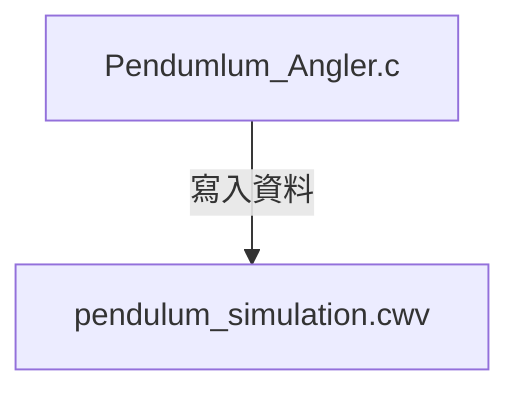

# 物理鉛直圓周運動 Runge Kutta 4 模擬
## 簡介
這個程式是用C語言利用 RK4 method 模擬鉛直面圓周運動，並將模擬結果紀錄在 csv 檔中，並用Python繪製Phase Space顯示出不同角度下PhaseSpace的圖形，此外Simulation.py 則是一個vpython 的模擬(目前暫時無法正常運作)


 

## 程式介紹
### Runge Kutta 4

龍格-庫塔法（英文：Runge-Kutta methods）是用於非線性常微分方程的解的重要的一類隱式或顯式迭代法。[^1]

$
\\ \displaystyle k_{1}=f\left(t_{n},y_{n}\right)\\ \displaystyle k_{2}=f\left(t_{n}+{h \over 2},y_{n}+{h\over 2}k_{1}\right)
\\ \displaystyle k_{3}=f\left(t_{n}+{h \over 2},y_{n}+{h \over 2}k_{2}\right)
\\ \displaystyle k_{4}=f\left(t_{n}+h,y_{n}+hk_{3}\right)
\\ 
\begin{aligned}y_{n+1}&=y_{n}+{\frac {h}{6}}\left(k_{1}+2k_{2}+2k_{3}+k_{4}\right),\\t_{n+1}&=t_{n}+h\\\end{aligned}
$
$k_1, k_2, k_3, k_4$ 皆為導數

上面的數學式用C語言實做出來後便成為
```c
void RK4(State *state, double dt, double length) {
    Derivative k1, k2, k3, k4;

    k1 = evaluate(state, length);
    State state1 = {state->theta + 0.5 * dt * k1.dtheta, state->omega + 0.5 * dt * k1.domega};
    k2 = evaluate(&state1, length);
    State state2 = {state->theta + 0.5 * dt * k2.dtheta, state->omega + 0.5 * dt * k2.domega};
    k3 = evaluate(&state2, length);
    State state3 = {state->theta + dt * k3.dtheta, state->omega + dt * k3.domega};
    k4 = evaluate(&state3, length);
    
    state->theta += (dt / 6.0) * (k1.dtheta + 2.0 * k2.dtheta + 2.0 * k3.dtheta + k4.dtheta);
    state->omega += (dt / 6.0) * (k1.domega + 2.0 * k2.domega + 2.0 * k3.domega + k4.domega);
}
```

### 檔案寫入
程式運作時是以將程式運行中的資料寫入 csv 檔中方便後續的作圖
``` c
FILE *data = fopen("pendulum_simulation.csv", "w+");
fprintf(data, "TIME,ANGLE,ANGULAR_VELOCITY\n");
```
### Python 作圖



[^1] https://en.wikipedia.org/wiki/Runge%E2%80%93Kutta_methods
